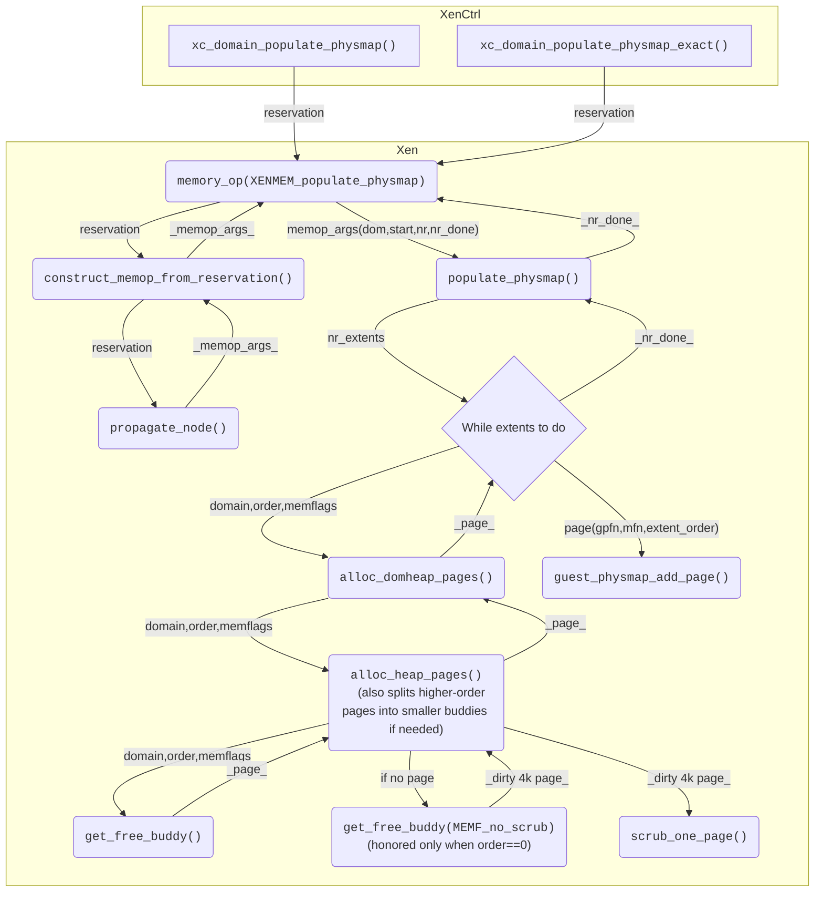

```mermaid
flowchart
subgraph XenCtrl
xc_domain_populate_physmap["<tt>xc_domain_populate_physmap()"]
xc_domain_populate_physmap_exact["<tt>xc_domain_populate_physmap_exact()"]
end
subgraph Xen
xc_domain_populate_physmap & xc_domain_populate_physmap_exact
--reservation--> memory_op("<tt>memory_op(XENMEM_populate_physmap)")
--reservation
-->construct_memop_from_reservation("<tt>construct_memop_from_reservation()")
--reservation-->propagate_node("<tt>propagate_node()")
--_memop_args_-->construct_memop_from_reservation
--_memop_args_-->memory_op
--memop_args(dom,start,nr,nr_done)
-->populate_physmap("<tt>populate_physmap()")
--nr_extents-->populate_physmap_loop{While extents to do}
--domain,order,memflags-->alloc_domheap_pages("<tt>alloc_domheap_pages()")
--domain,order,memflags-->alloc_heap_pages("<tt>alloc_heap_pages()</tt>
    (also splits higher-order pages into smaller buddies if needed)")
--domain,order,memflags-->get_free_buddy("<tt>get_free_buddy()</tt>")
--_page_-->alloc_heap_pages
--if no page
-->get_free_buddy_noscrub("<tt>get_free_buddy(MEMF_no_scrub)</tt>
(honored only when order==0)")--_dirty 4k page_-->alloc_heap_pages
--_dirty 4k page_-->scrub_one_page("<tt>scrub_one_page()")
alloc_heap_pages
--_page_-->alloc_domheap_pages
--_page_-->populate_physmap_loop
--page(gpfn,mfn,extent_order)
-->guest_physmap_add_page("<tt>guest_physmap_add_page()")
populate_physmap_loop
--_nr_done_-->populate_physmap
--_nr_done_-->memory_op
end
click memory_op
"https://github.com/xen-project/xen/blob/e16acd80/xen/common/memory.c#L1409-L1425" _blank
click construct_memop_from_reservation
"https://github.com/xen-project/xen/blob/master/xen/common/memory.c#L1022" _blank
click propagate_node
"https://github.com/xen-project/xen/blob/master/xen/common/memory.c#L524-L547" _blank
click populate_physmap
"https://github.com/xen-project/xen/blob/master/xen/common/memory.c#L159-L314" _blank
click populate_physmap_loop
"https://github.com/xen-project/xen/blob/master/xen/common/memory.c#L197-L304" _blank
click alloc_domheap_pages
"https://github.com/xen-project/xen/blob/master/xen/common/page_alloc.c#L2641" _blank
click alloc_heap_pages
"https://github.com/xen-project/xen/blob/master/xen/common/page_alloc.c#L968" _blank
click get_free_buddy
"https://github.com/xen-project/xen/blob/e16acd80/xen/common/page_alloc.c#L855" _blank
```
